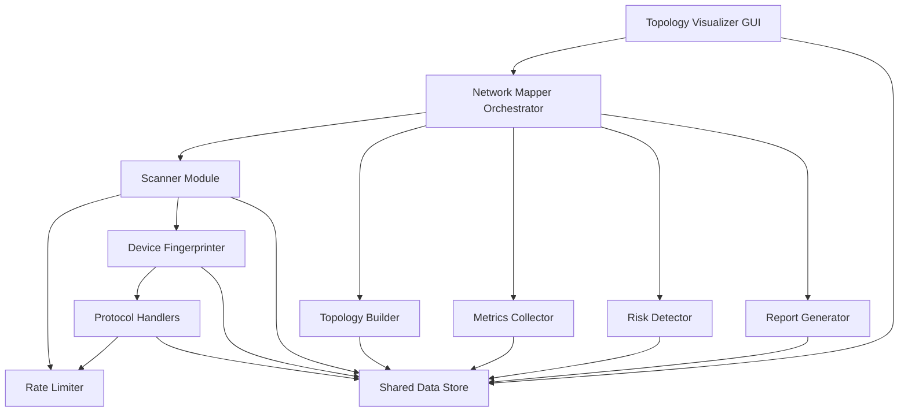

# Design Document: Complete Network Mapper

## Overview

The Complete Network Mapper is a comprehensive Rust-based network discovery and monitoring application that scans networks, identifies devices, maps topology, collects performance metrics, detects security risks, and visualizes network infrastructure through a GUI. The system builds upon an existing skeleton with eframe/egui GUI, tokio async runtime, and configuration management.

The application follows a modular architecture with distinct components for scanning, device fingerprinting, protocol handling, topology building, metrics collection, risk detection, reporting, and visualization. All components operate asynchronously to handle large networks efficiently while respecting rate limits to avoid network disruption.

Key design principles:
- Asynchronous operation using tokio for concurrent scanning and data collection
- Modular component design with clear separation of concerns
- Graceful error handling to ensure partial failures don't stop overall operation
- Rate limiting and security controls to prevent network disruption
- Real-time GUI updates using egui's reactive model
- Extensible protocol handler system for adding new device interrogation methods

## Architecture

### System Architecture



### Component Responsibilities

1. **Network Mapper Orchestrator**: Coordinates all scanning, discovery, and analysis operations. Manages the scan lifecycle and triggers periodic updates.

2. **Scanner Module**: Contains ARP, ICMP, and Port scanners. Discovers active devices and open ports on target networks.

3. **Device Fingerprinter**: Analyzes scan results to classify device types and identify operating systems through banner grabbing and port pattern analysis.

4. **Protocol Handlers**: SNMP, WMI, and SSH handlers that query devices for detailed configuration and status information.

5. **Topology Builder**: Constructs Layer 2 and Layer 3 network topology maps from scan data, SNMP tables, and routing information.

6. **Metrics Collector**: Gathers performance data (CPU, memory, bandwidth) from devices using SNMP, WMI, or SSH.

7. **Risk Detector**: Identifies security vulnerabilities, misconfigurations, and policy violations based on scan results and device characteristics.

8. **Report Generator**: Produces comprehensive reports in JSON, CSV, and HTML formats with device inventory, topology summaries, security findings, and performance statistics.

9. **Topology Visualizer**: GUI component that renders network topology graphically with interactive node exploration.

10. **Rate Limiter**: Controls scanning intensity to prevent network disruption and security alert triggering.

11. **Shared Data Store**: Thread-safe storage for discovered devices, topology maps, metrics, and security findings.

### Data Flow

1. User initiates scan through GUI or configuration
2. Orchestrator triggers Scanner with target network ranges
3. Scanner performs ARP, ICMP, and port scans (rate-limited)
4. Fingerprinter analyzes scan results to classify devices
5. Protocol Handlers query devices for detailed information
6. Topology Builder constructs network maps from collected data
7. Metrics Collector gathers performance data from devices
8. Risk Detector analyzes devices and topology for security issues
9. All data stored in Shared Data Store
10. GUI continuously reads from Data Store for visualization
11. Report Generator produces reports on demand

## Components and Interfaces

### Scanner Module

**Purpose**: Discover active devices and open ports on target networks.

**Sub-components**:
- `ARPScanner`: Layer 2 discovery using ARP requests
- `ICMPScanner`: Layer 3 discovery using ICMP echo requests
- `PortScanner`: TCP and UDP port probing

**Interface**:
```rust
#[async_trait]
pub trait Scanner: Send + Sync {
    async fn scan(&self, target: ScanTarget) -> Result<Vec<ScanResult>, ScanError>;
}

pub struct ScanTarget {
    pub network: IpNetwork,
    pub scan_types: Vec<ScanType>,
}

pub enum ScanType {
    ARP,
    ICMP,
    TCPPorts(Vec<u16>),
    UDPPorts(Vec<u16>),
}

pub struct ScanResult {
    pub ip: IpAddr,
    pub mac: Option<MacAddr>,
    pub icmp_responsive: bool,
    pub open_tcp_ports: Vec<u16>,
    pub open_udp_ports: Vec<u16>,
    pub scan_timestamp: SystemTime,
}
```

**Implementation Notes**:
- Use raw sockets for ARP and ICMP (requires elevated privileges)
- TCP scanning uses SYN scan technique (half-open connections)
- UDP scanning sends protocol-specific probes and waits for responses
- All operations respect Rate Limiter constraints
- Timeouts: ICMP 2s, TCP 1s, UDP 2s

### Device Fingerprinter

**Purpose**: Classify devices and identify operating systems based on scan results.

**Interface**:
```rust
pub struct DeviceFingerprinter {
    banner_grabber: BannerGrabber,
}

impl DeviceFingerprinter {
    pub async fn fingerprint(&self, scan_result: &ScanResult) -> DeviceProfile {
        // Analyze ports, grab banners, classify device
    }
}

pub struct DeviceProfile {
    pub device_type: DeviceType,
    pub os_family: Option<OsFamily>,
    pub os_version: Option<String>,
    pub confidence: u8, // 0-100
    pub snmp_capable: bool,
    pub ssh_capable: bool,
    pub wmi_capable: bool,
}

#[derive(Debug, Clone, Serialize, Deserialize)]
pub enum DeviceType {
    Router,
    Switch,
    Firewall,
    Server,
    Workstation,
    Printer,
    IoTDevice,
    Unknown,
}

#[derive(Debug, Clone, Serialize, Deserialize)]
pub enum OsFamily {
    Windows,
    Linux,
    Unix,
    MacOS,
    NetworkOS,
    Unknown,
}
```

**Classification Rules**:
- Windows: Ports 135, 139, 445 open
- Unix/Linux: Ports 22, 111 open without Windows ports
- Web Server: Ports 80, 443, 8080, 8443 with minimal other services
- Network Device: Ports 161, 162 with many other ports
- Printer: Ports 515, 631, 9100

### Protocol Handlers

**Purpose**: Query devices using standard management protocols for detailed information.

**Interface**:
```rust
#[async_trait]
pub trait ProtocolHandler: Send + Sync {
    async fn query(&self, device: &Device, credentials: &Credentials) 
        -> Result<DeviceInfo, ProtocolError>;
    fn timeout(&self) -> Duration;
}

pub struct SNMPHandler {
    community_strings: Vec<String>,
}

pub struct WMIHandler {
    // WMI-specific configuration
}

pub struct SSHHandler {
    // SSH-specific configuration
}

pub struct DeviceInfo {
    pub hostname: Option<String>,
    pub system_description: Option<String>,
    pub uptime: Option<Duration>,
    pub interfaces: Vec<NetworkInterface>,
    pub routing_table: Vec<Route>,
    pub arp_table: Vec<ArpEntry>,
}

pub struct NetworkInterface {
    pub name: String,
    pub mac: MacAddr,
    pub ip_addresses: Vec<IpAddr>,
    pub speed: Option<u64>, // bits per second
    pub status: InterfaceStatus,
}
```

**Implementation Notes**:
- SNMP: Try "public" first, then configured alternatives. Query sysDescr, sysName, sysUpTime, ifTable, ipRouteTable, ipNetToMediaTable
- WMI: Query Win32_ComputerSystem, Win32_OperatingSystem, Win32_NetworkAdapter, Win32_IP4RouteTable
- SSH: Execute commands (hostname, uname -a, ip addr/ifconfig, ip route/netstat -rn, arp -a)
- All handlers timeout after 10 seconds
- Authentication failures are logged but don't block other operations

### Topology Builder

**Purpose**: Construct Layer 2 and Layer 3 network topology maps.

**Interface**:
```rust
pub struct TopologyBuilder {
    current_topology: Arc<RwLock<NetworkTopology>>,
    historical_topologies: Vec<NetworkTopology>,
}

impl TopologyBuilder {
    pub async fn update_topology(&mut self, devices: &[Device]) {
        // Incrementally update topology
    }
    
    pub fn get_layer2_topology(&self) -> Layer2Topology {
        // Return Layer 2 map
    }
    
    pub fn get_layer3_topology(&self) -> Layer3Topology {
        // Return Layer 3 map
    }
    
    pub fn detect_loops(&self) -> Vec<TopologyAnomaly> {
        // Detect Layer 2 loops
    }
}

pub struct NetworkTopology {
    pub devices: HashMap<IpAddr, Device>,
    pub layer2: Layer2Topology,
    pub layer3: Layer3Topology,
    pub vlans: HashMap<u16, Vlan>,
    pub timestamp: SystemTime,
}

pub struct Layer2Topology {
    pub connections: HashMap<MacAddr, Vec<MacAddr>>,
    pub switch_ports: HashMap<MacAddr, Vec<SwitchPort>>,
}

pub struct Layer3Topology {
    pub connections: HashMap<IpAddr, Vec<IpAddr>>,
    pub routes: HashMap<IpAddr, Vec<Route>>,
    pub subnets: Vec<IpNetwork>,
}
```

**Topology Discovery Strategy**:
1. Use SNMP CDP/LLDP neighbor data for direct Layer 2 connections
2. Parse ARP tables to map IP-to-MAC relationships
3. Analyze routing tables for Layer 3 connectivity
4. Infer connections from subnet membership when direct data unavailable
5. Detect VLANs from SNMP VLAN tables
6. Identify loops by finding redundant MAC paths

### Metrics Collector

**Purpose**: Gather performance metrics from devices.

**Interface**:
```rust
pub struct MetricsCollector {
    retention_period: Duration,
    metrics_store: Arc<RwLock<MetricsStore>>,
}

impl MetricsCollector {
    pub async fn collect_metrics(&self, device: &Device) -> Result<(), MetricsError> {
        // Collect metrics based on device capabilities
    }
    
    pub fn get_metrics(&self, device: &IpAddr, metric_name: &str, 
                       time_range: TimeRange) -> Vec<MetricPoint> {
        // Retrieve historical metrics
    }
}

pub struct MetricPoint {
    pub timestamp: SystemTime,
    pub device: IpAddr,
    pub metric_name: String,
    pub value: f64,
}

pub enum MetricType {
    CpuUsage,
    MemoryUsage,
    InterfaceBandwidthIn,
    InterfaceBandwidthOut,
    InterfaceErrors,
    InterfacePackets,
}
```

**Collection Strategy**:
- SNMP devices: Query hrProcessorLoad, hrStorageUsed/hrStorageSize, ifInOctets/ifOutOctets, ifInErrors/ifOutErrors
- WMI devices: Query Win32_Processor.LoadPercentage, Win32_OperatingSystem.FreePhysicalMemory
- SSH devices: Parse output from top/vmstat, netstat -i/ip -s link
- Calculate deltas for counter-based metrics (bandwidth, packet counts)
- Store with timestamp and retain for configured period (default 7 days)

### Risk Detector

**Purpose**: Identify security vulnerabilities and misconfigurations.

**Interface**:
```rust
pub struct RiskDetector {
    rules: Vec<Box<dyn RiskRule>>,
}

impl RiskDetector {
    pub fn detect_risks(&self, topology: &NetworkTopology) -> Vec<SecurityRisk> {
        // Apply all risk detection rules
    }
}

pub struct SecurityRisk {
    pub risk_type: RiskType,
    pub severity: Severity,
    pub affected_device: IpAddr,
    pub description: String,
    pub remediation: String,
    pub detected_at: SystemTime,
}

#[derive(Debug, Clone, Serialize, Deserialize)]
pub enum Severity {
    Critical,
    High,
    Medium,
    Low,
}

pub enum RiskType {
    InsecureProtocol,
    DefaultCredentials,
    ExcessiveExposure,
    DeviceDisappeared,
    MacSpoofing,
    OutdatedOS,
    TopologyAnomaly,
    StealthDevice,
}
```

**Detection Rules**:
- Insecure protocols: Telnet (23), FTP (21)
- Default SNMP communities: "public", "private"
- SSH password authentication enabled
- RDP (3389) exposed to non-management networks
- Excessive open ports (>20)
- Device disappeared (not seen for 24 hours)
- MAC spoofing (MAC previously on different IP)
- Outdated OS versions
- Layer 2 loops without spanning tree
- Stealth devices (ICMP responsive but blocks all TCP/UDP)

### Report Generator

**Purpose**: Produce comprehensive network documentation and analysis reports.

**Interface**:
```rust
pub struct ReportGenerator;

impl ReportGenerator {
    pub fn generate_report(&self, topology: &NetworkTopology, 
                          risks: &[SecurityRisk],
                          metrics: &MetricsStore,
                          format: ReportFormat) -> Result<Report, ReportError> {
        // Generate report in specified format
    }
}

pub enum ReportFormat {
    JSON,
    CSV,
    HTML,
}

pub struct Report {
    pub device_inventory: Vec<DeviceInventoryEntry>,
    pub topology_summary: TopologySummary,
    pub security_findings: Vec<SecurityRisk>,
    pub performance_summary: PerformanceSummary,
    pub generation_timestamp: SystemTime,
    pub scan_coverage: f64, // percentage
}

pub struct DeviceInventoryEntry {
    pub ip: IpAddr,
    pub mac: MacAddr,
    pub hostname: String,
    pub device_type: DeviceType,
    pub os: String,
    pub open_ports: Vec<u16>,
}

pub struct TopologySummary {
    pub subnet_count: usize,
    pub device_type_distribution: HashMap<DeviceType, usize>,
    pub connection_statistics: ConnectionStats,
}

pub struct PerformanceSummary {
    pub avg_cpu_by_type: HashMap<DeviceType, f64>,
    pub avg_memory_by_type: HashMap<DeviceType, f64>,
    pub avg_bandwidth_by_type: HashMap<DeviceType, f64>,
}
```

**Report Contents**:
- Device inventory: IP, MAC, hostname, type, OS, open ports
- Topology summary: Subnet counts, device distribution, connection stats
- Security findings: Grouped by severity with affected devices
- Performance summary: Average metrics per device type
- HTML reports include embedded topology visualization
- Generation must complete within 5 seconds for networks up to 1000 devices

### Topology Visualizer

**Purpose**: Render network topology graphically in the GUI.

**Interface**:
```rust
pub struct TopologyVisualizer {
    layout_engine: ForceDirectedLayout,
    node_positions: HashMap<IpAddr, Position>,
    selected_node: Option<IpAddr>,
    zoom_level: f32,
    pan_offset: Position,
}

impl TopologyVisualizer {
    pub fn render(&mut self, ui: &mut egui::Ui, topology: &NetworkTopology) {
        // Render topology visualization
    }
    
    pub fn handle_interaction(&mut self, ui: &egui::Ui) -> Option<VisualizerEvent> {
        // Handle user interactions (clicks, zoom, pan)
    }
}

pub struct ForceDirectedLayout {
    // Force-directed graph layout algorithm
}

pub enum VisualizerEvent {
    NodeSelected(IpAddr),
    ConnectionSelected(IpAddr, IpAddr),
    NodeMoved(IpAddr, Position),
}
```

**Visualization Features**:
- Color-coded nodes by device type (routers, switches, servers, endpoints)
- Node labels show IP and hostname
- Solid lines for Layer 2 connections, dashed for Layer 3
- Warning icons on nodes with security risks
- Click node for detailed device information panel
- Click connection for connection details (bandwidth, latency, packet loss)
- Zoom and pan support for large networks
- Force-directed layout for automatic positioning
- Manual node repositioning with position persistence
- Refresh without losing view position

### Rate Limiter

**Purpose**: Control scanning intensity to prevent network disruption.

**Interface**:
```rust
pub struct RateLimiter {
    config: RateLimitConfig,
    packet_limiter: TokenBucket,
    connection_limiter: Semaphore,
}

impl RateLimiter {
    pub async fn acquire_packet_permit(&self, scan_type: ScanType) {
        // Wait until packet can be sent
    }
    
    pub async fn acquire_connection_permit(&self) -> ConnectionPermit {
        // Wait until connection can be made
    }
}

pub struct RateLimitConfig {
    pub max_packets_per_second: u32,
    pub max_concurrent_connections: u32,
    pub arp_rate: u32,
    pub icmp_rate: u32,
    pub tcp_rate: u32,
    pub udp_rate: u32,
    pub stealth_mode: bool,
}

struct TokenBucket {
    // Token bucket algorithm implementation
}
```

**Rate Limiting Strategy**:
- Default: 100 packets per second, 50 concurrent connections
- Per-scan-type limits: Configurable for ARP, ICMP, TCP, UDP
- Stealth mode: Reduce to 10% of normal rate, randomize scan order, add random delays
- Token bucket algorithm for packet rate limiting
- Semaphore for connection limiting
- Whitelist: Exclude sensitive devices from scanning
- Blacklist: Prevent scanning external/unauthorized networks

## Data Models

### Core Data Structures

```rust
#[derive(Debug, Clone, Serialize, Deserialize)]
pub struct Device {
    pub ip: IpAddr,
    pub mac: MacAddr,
    pub hostname: String,
    pub device_type: DeviceType,
    pub os_family: OsFamily,
    pub os_version: Option<String>,
    pub open_ports: Vec<u16>,
    pub interfaces: Vec<NetworkInterface>,
    pub first_seen: SystemTime,
    pub last_seen: SystemTime,
    pub confidence: u8,
}

#[derive(Debug, Clone, Copy, PartialEq, Eq, Hash, Serialize, Deserialize)]
pub struct MacAddr([u8; 6]);

#[derive(Debug, Clone, Serialize, Deserialize)]
pub struct NetworkInterface {
    pub name: String,
    pub mac: MacAddr,
    pub ip_addresses: Vec<IpAddr>,
    pub speed: Option<u64>,
    pub status: InterfaceStatus,
    pub vlan: Option<u16>,
}

#[derive(Debug, Clone, Serialize, Deserialize)]
pub enum InterfaceStatus {
    Up,
    Down,
    Unknown,
}

#[derive(Debug, Clone, Serialize, Deserialize)]
pub struct Route {
    pub destination: IpNetwork,
    pub gateway: IpAddr,
    pub interface: String,
    pub metric: u32,
}

#[derive(Debug, Clone, Serialize, Deserialize)]
pub struct ArpEntry {
    pub ip: IpAddr,
    pub mac: MacAddr,
    pub interface: String,
}

#[derive(Debug, Clone, Serialize, Deserialize)]
pub struct Vlan {
    pub id: u16,
    pub name: String,
    pub devices: Vec<IpAddr>,
}

#[derive(Debug, Clone, Serialize, Deserialize)]
pub struct SwitchPort {
    pub port_number: u32,
    pub connected_mac: MacAddr,
    pub vlan: u16,
    pub status: InterfaceStatus,
}
```

### Shared Data Store

```rust
pub struct SharedDataStore {
    devices: Arc<RwLock<HashMap<IpAddr, Device>>>,
    topology: Arc<RwLock<NetworkTopology>>,
    metrics: Arc<RwLock<MetricsStore>>,
    risks: Arc<RwLock<Vec<SecurityRisk>>>,
    scan_history: Arc<RwLock<Vec<ScanRecord>>>,
}

impl SharedDataStore {
    pub fn new() -> Self {
        // Initialize with empty collections
    }
    
    pub async fn update_device(&self, device: Device) {
        // Thread-safe device update
    }
    
    pub async fn get_device(&self, ip: &IpAddr) -> Option<Device> {
        // Thread-safe device retrieval
    }
    
    pub async fn get_all_devices(&self) -> Vec<Device> {
        // Thread-safe retrieval of all devices
    }
    
    // Similar methods for topology, metrics, risks
}

pub struct MetricsStore {
    metrics: HashMap<(IpAddr, String), VecDeque<MetricPoint>>,
    retention_period: Duration,
}

impl MetricsStore {
    pub fn add_metric(&mut self, point: MetricPoint) {
        // Add metric and prune old data
    }
    
    pub fn get_metrics(&self, device: &IpAddr, metric_name: &str, 
                       time_range: TimeRange) -> Vec<MetricPoint> {
        // Retrieve metrics within time range
    }
}

pub struct ScanRecord {
    pub scan_id: Uuid,
    pub target: ScanTarget,
    pub start_time: SystemTime,
    pub end_time: Option<SystemTime>,
    pub devices_discovered: usize,
    pub errors: Vec<String>,
}
```

### Configuration Model

```rust
#[derive(Debug, Deserialize, Serialize)]
pub struct AppConfig {
    pub scan_interval: u64,
    pub target_networks: Vec<String>,
    pub log_level: String,
    pub rate_limit: RateLimitConfig,
    pub credentials: CredentialsConfig,
    pub features: FeatureFlags,
    pub retention: RetentionConfig,
}

#[derive(Debug, Deserialize, Serialize)]
pub struct CredentialsConfig {
    pub snmp_communities: Vec<String>,
    pub ssh_credentials: Vec<SshCredential>,
    pub wmi_credentials: Vec<WmiCredential>,
}

#[derive(Debug, Deserialize, Serialize)]
pub struct SshCredential {
    pub username: String,
    pub password: Option<String>,
    pub private_key: Option<String>,
}

#[derive(Debug, Deserialize, Serialize)]
pub struct WmiCredential {
    pub username: String,
    pub password: String,
    pub domain: Option<String>,
}

#[derive(Debug, Deserialize, Serialize)]
pub struct FeatureFlags {
    pub snmp_enabled: bool,
    pub wmi_enabled: bool,
    pub ssh_enabled: bool,
    pub metrics_collection_enabled: bool,
    pub stealth_mode: bool,
}

#[derive(Debug, Deserialize, Serialize)]
pub struct RetentionConfig {
    pub metrics_retention_days: u32,
    pub scan_history_retention_days: u32,
    pub log_retention_days: u32,
}
```

### Error Types

```rust
#[derive(Debug, thiserror::Error)]
pub enum ScanError {
    #[error("Network error: {0}")]
    NetworkError(String),
    #[error("Timeout")]
    Timeout,
    #[error("Permission denied")]
    PermissionDenied,
    #[error("Invalid target: {0}")]
    InvalidTarget(String),
    #[error("Rate limit exceeded")]
    RateLimitExceeded,
}

#[derive(Debug, thiserror::Error)]
pub enum ProtocolError {
    #[error("Authentication failed")]
    AuthenticationFailed,
    #[error("Connection refused")]
    ConnectionRefused,
    #[error("Timeout")]
    Timeout,
    #[error("Protocol error: {0}")]
    ProtocolError(String),
    #[error("Unsupported operation")]
    UnsupportedOperation,
}

#[derive(Debug, thiserror::Error)]
pub enum MetricsError {
    #[error("Device not found")]
    DeviceNotFound,
    #[error("Metric collection failed: {0}")]
    CollectionFailed(String),
    #[error("Storage error: {0}")]
    StorageError(String),
}

#[derive(Debug, thiserror::Error)]
pub enum ReportError {
    #[error("Insufficient data")]
    InsufficientData,
    #[error("Format error: {0}")]
    FormatError(String),
    #[error("IO error: {0}")]
    IoError(#[from] std::io::Error),
}
```


## Correctness Properties

A property is a characteristic or behavior that should hold true across all valid executions of a system—essentially, a formal statement about what the system should do. Properties serve as the bridge between human-readable specifications and machine-verifiable correctness guarantees.

### Property Reflection

After analyzing all 120 acceptance criteria, several opportunities for consolidation emerged:

- Scanning properties 1.1 and 1.3 (ARP and ICMP request generation) can be combined into a general "scanner coverage" property
- Port scanning properties 1.6 and 1.9 (TCP and UDP port probing) can be combined
- Multiple fingerprinting properties (2.2-2.4) for banner grabbing can be consolidated
- Device classification properties (2.7-2.11) can be combined into a single classification rule property
- Protocol handler timeout properties (1.7, 3.12) can be unified
- Multiple metrics collection properties (5.1-5.8) testing conditional collection can be consolidated
- Risk detection properties (6.1-6.11) can be grouped by detection pattern
- Report content properties (7.1-7.8) can be consolidated into comprehensive report structure properties
- Error handling properties (9.1-9.6) can be unified into general error resilience properties

### Property 1: Scanner Coverage Completeness

For any scan target network range, the scanner shall generate scan requests (ARP, ICMP, or port probes) for all IP addresses within that range.

**Validates: Requirements 1.1, 1.3, 1.6, 1.9**

### Property 2: Scan Response Recording

For any scan response received (ARP reply, ICMP reply, TCP SYN-ACK, UDP response), the scanner shall record the response with the correct device identification (IP, MAC, port) and status.

**Validates: Requirements 1.2, 1.4, 1.5, 1.8, 1.10**

### Property 3: Scan Result Completeness

For any completed scan of a target network, the scanner shall return a list where each discovered device includes IP address, MAC address (if available), and all detected open ports.

**Validates: Requirements 1.12**

### Property 4: Rate Limiting Enforcement

For any scanning operation, the measured packet rate shall not exceed the configured maximum packets per second, and concurrent connections shall not exceed the configured maximum.

**Validates: Requirements 1.11, 10.1, 10.2, 10.3, 10.4**

### Property 5: Scan Operation Timeout Compliance

For any network operation (TCP connection, ICMP probe, UDP probe, protocol query), the operation shall complete or timeout within the specified time limit (1s for TCP, 2s for ICMP/UDP, 10s for protocol handlers).

**Validates: Requirements 1.7, 3.12**

### Property 6: Fingerprinting Trigger Completeness

For any device with open ports, the fingerprinter shall attempt appropriate banner grabbing or analysis based on the port (SSH on 22, HTTP on 80/443, Telnet on 23, SNMP marking on 161).

**Validates: Requirements 2.1, 2.2, 2.3, 2.4, 2.5**

### Property 7: Banner Parsing Extraction

For any retrieved banner information, the fingerprinter shall parse it to extract operating system and version information when present.

**Validates: Requirements 2.6**

### Property 8: Device Classification Rules

For any device with a specific port combination, the fingerprinter shall classify it according to the defined rules (Windows: 135/139/445, Unix: 22/111 without Windows ports, Web Server: 80/443/8080/8443 only, Network Device: 161/162 with many ports, Printer: 515/631/9100).

**Validates: Requirements 2.7, 2.8, 2.9, 2.10, 2.11**

### Property 9: Classification Confidence Scoring

For any device classification, the fingerprinter shall assign a confidence score between 0 and 100 inclusive.

**Validates: Requirements 2.12**

### Property 10: Protocol Handler Conditional Execution

For any device marked as capable of a protocol (SNMP, WMI, SSH) and where that protocol is enabled in configuration, the corresponding protocol handler shall attempt to query the device.

**Validates: Requirements 3.1, 3.5, 3.8**

### Property 11: SNMP Query Completeness

For any successful SNMP query, the handler shall retrieve sysDescr, sysName, sysUpTime, and ifTable, and parse interface information including speed, status, and MAC addresses.

**Validates: Requirements 3.2, 3.4**

### Property 12: SNMP Community String Fallback

For any SNMP query that fails with the "public" community string, the handler shall attempt all configured alternative community strings before giving up.

**Validates: Requirements 3.3**

### Property 13: WMI Query Completeness

For any successful WMI connection, the handler shall query Win32_ComputerSystem, Win32_OperatingSystem, and Win32_NetworkAdapter, and extract hostname, OS version, domain membership, and network interfaces.

**Validates: Requirements 3.6, 3.7**

### Property 14: SSH Command Execution Completeness

For any successful SSH connection, the handler shall execute hostname, uname -a, and ip addr/ifconfig commands, and parse the output to extract hostname, OS information, and interface details.

**Validates: Requirements 3.9, 3.10**

### Property 15: Protocol Handler Error Resilience

For any protocol handler authentication failure, the handler shall log the failure and allow other operations to continue without blocking.

**Validates: Requirements 3.11**

### Property 16: Topology Entry Creation from Interface Data

For any SNMP ifTable data with multiple interfaces, ARP table data, or CDP/LLDP neighbor information, the topology builder shall create corresponding Layer 2 topology entries.

**Validates: Requirements 4.1, 4.2, 4.3**

### Property 17: Multi-Interface Routing Topology

For any device with multiple network interfaces on different subnets, the topology builder shall create Layer 3 topology entries representing routing relationships.

**Validates: Requirements 4.4**

### Property 18: Routing Data Topology Construction

For any routing table data or traceroute data retrieved from a device, the topology builder shall create Layer 3 topology entries for each route or hop.

**Validates: Requirements 4.5, 4.6, 4.7**

### Property 19: Layer 2 Loop Detection

For any network topology, the topology builder shall detect Layer 2 loops by identifying redundant MAC address paths.

**Validates: Requirements 4.8**

### Property 20: VLAN Identification and Grouping

For any SNMP VLAN table data, the topology builder shall identify VLANs and group devices accordingly.

**Validates: Requirements 4.9**

### Property 21: Topology Inference from Incomplete Data

For any topology with incomplete connection data, the topology builder shall infer connections based on subnet membership and gateway configurations.

**Validates: Requirements 4.10**

### Property 22: Incremental Topology Updates

For any new scan data added to the system, the topology builder shall update the topology map incrementally without requiring a full rebuild.

**Validates: Requirements 4.11**

### Property 23: Topology State History Maintenance

For any topology update, the topology builder shall maintain both the current topology state and historical topology states for change detection.

**Validates: Requirements 4.12**

### Property 24: Conditional Metrics Collection

For any device that supports a protocol (SNMP, WMI, SSH) and where metrics collection is enabled, the metrics collector shall query the appropriate metrics for that protocol (CPU, memory, bandwidth, errors).

**Validates: Requirements 5.1, 5.2, 5.3, 5.4, 5.5, 5.6, 5.7, 5.8**

### Property 25: Counter-Based Metrics Delta Calculation

For any counter-based metric (bandwidth, packet counts) collected at two different times, the metrics collector shall calculate and store the delta value.

**Validates: Requirements 5.9**

### Property 26: Metric Storage Completeness

For any collected metric, the stored metric point shall include timestamp, device IP, metric name, and metric value.

**Validates: Requirements 5.10**

### Property 27: Metrics Retention Policy Enforcement

For any metric older than the configured retention period (default 7 days), the metrics collector shall prune it from storage.

**Validates: Requirements 5.11**

### Property 28: Metrics Collection Error Resilience

For any metric collection failure on a device, the metrics collector shall log the error and continue collecting from other devices.

**Validates: Requirements 5.12**

### Property 29: Port-Based Risk Detection

For any device with specific insecure ports open (23 for Telnet, 21 for FTP, 3389 for RDP on non-management networks), the risk detector shall flag it with the corresponding risk type.

**Validates: Requirements 6.1, 6.2, 6.5**

### Property 30: Configuration-Based Risk Detection

For any device using default SNMP community strings ("public" or "private") or SSH password authentication, the risk detector shall flag it with the corresponding risk type.

**Validates: Requirements 6.3, 6.4**

### Property 31: Threshold-Based Risk Detection

For any device with more than 20 open TCP ports, the risk detector shall flag it as "Excessive Open Ports".

**Validates: Requirements 6.6**

### Property 32: Temporal Risk Detection

For any device not seen in scans for 24 hours after initial discovery, the risk detector shall flag it as "Device Disappeared".

**Validates: Requirements 6.7**

### Property 33: MAC-IP Relationship Risk Detection

For any MAC address that appears with a different IP address than previously recorded, the risk detector shall flag it as "Possible MAC Spoofing".

**Validates: Requirements 6.8**

### Property 34: OS Version Risk Detection

For any device with an outdated OS version based on banner information, the risk detector shall flag it as "Outdated Operating System".

**Validates: Requirements 6.9**

### Property 35: Topology-Based Risk Detection

For any Layer 2 topology showing a loop without spanning tree protocol, the risk detector shall flag it as "Layer 2 Loop Detected".

**Validates: Requirements 6.10**

### Property 36: Scan Pattern Risk Detection

For any device that responds to ICMP but blocks all TCP/UDP probes, the risk detector shall flag it as "Stealth Device".

**Validates: Requirements 6.11**

### Property 37: Risk Severity Assignment

For any identified security risk, the risk detector shall assign a severity level (Critical, High, Medium, or Low).

**Validates: Requirements 6.12**

### Property 38: Report Structure Completeness

For any report generation request, the report shall include device inventory, topology summary, security findings, and performance summary sections.

**Validates: Requirements 7.1, 7.3, 7.5, 7.7**

### Property 39: Device Inventory Entry Completeness

For any device in the device inventory section, the entry shall include IP, MAC, hostname, device type, OS, and open ports.

**Validates: Requirements 7.2**

### Property 40: Topology Summary Content Completeness

For any topology summary section, it shall include subnet counts, device type distribution, and connection statistics.

**Validates: Requirements 7.4**

### Property 41: Security Findings Organization

For any security findings section, risks shall be grouped by severity and include affected device details.

**Validates: Requirements 7.6**

### Property 42: Performance Summary Content Completeness

For any performance summary section, it shall include CPU, memory, and bandwidth utilization statistics.

**Validates: Requirements 7.8**

### Property 43: Report Format Support

For any report generation request, the report generator shall support producing output in JSON, CSV, and HTML formats.

**Validates: Requirements 7.9**

### Property 44: HTML Report Visualization Embedding

For any report generated in HTML format, it shall include embedded topology visualization.

**Validates: Requirements 7.10**

### Property 45: Report Generation Performance

For any network with up to 1000 devices, report generation shall complete within 5 seconds.

**Validates: Requirements 7.11**

### Property 46: Report Metadata Completeness

For any generated report, it shall include report generation timestamp and scan coverage percentage.

**Validates: Requirements 7.12**

### Property 47: Device Node Rendering

For any discovered device in the topology, the visualizer shall render it as a node in the GUI.

**Validates: Requirements 8.1**

### Property 48: Device Type Visual Differentiation

For any two devices of different types, the visualizer shall render them with different colors.

**Validates: Requirements 8.2**

### Property 49: Node Label Completeness

For any rendered device node, the label shall display both the device IP address and hostname.

**Validates: Requirements 8.3**

### Property 50: Connection Rendering Differentiation

For any Layer 2 topology connection, the visualizer shall render it as a solid line, and for any Layer 3 topology connection, the visualizer shall render it as a dashed line.

**Validates: Requirements 8.4, 8.5**

### Property 51: Risk Visualization

For any device with identified security risks, the visualizer shall display a warning icon on the node.

**Validates: Requirements 8.6**

### Property 52: Node Interaction Detail Display

For any user click on a device node, the visualizer shall display detailed device information in a side panel.

**Validates: Requirements 8.7**

### Property 53: Connection Interaction Detail Display

For any user click on a connection line, the visualizer shall display connection details (bandwidth, latency, packet loss).

**Validates: Requirements 8.8**

### Property 54: Visualization Navigation Support

For any topology visualization, the visualizer shall support zoom and pan operations.

**Validates: Requirements 8.9**

### Property 55: Force-Directed Layout Application

For any topology visualization, the visualizer shall use a force-directed layout algorithm to position nodes automatically.

**Validates: Requirements 8.10**

### Property 56: Manual Node Positioning Persistence

For any manual node repositioning by the user (where user preferences allow), the visualizer shall persist the new position.

**Validates: Requirements 8.11**

### Property 57: View Position Preservation on Refresh

For any topology data update that triggers a display refresh, the visualizer shall maintain the user's current view position (zoom level and pan offset).

**Validates: Requirements 8.12**

### Property 58: Network Operation Error Resilience

For any network operation timeout or connection refusal, the network mapper shall log the error and continue with the next operation.

**Validates: Requirements 9.1, 9.2**

### Property 59: Protocol Handler Failure Resilience

For any protocol handler authentication failure, the network mapper shall log the failure and attempt other available protocols.

**Validates: Requirements 9.3**

### Property 60: Protocol-Specific Error Handling

For any SNMP query error, SSH connection failure, or WMI connection failure, the respective handler shall log the error and mark the device appropriately without blocking other operations.

**Validates: Requirements 9.4, 9.5, 9.6**

### Property 61: Configuration Error Fallback

For any missing or invalid configuration file, the network mapper shall use default configuration values and log a warning.

**Validates: Requirements 9.7**

### Property 62: Invalid Target Rejection

For any invalid scan target network range, the network mapper shall return an error message and refuse to start scanning.

**Validates: Requirements 9.8**

### Property 63: Resource Monitoring and Response

For any condition where memory usage exceeds 80% or disk space falls below 100MB, the network mapper shall take appropriate action (pause scanning or rotate logs) and log a warning.

**Validates: Requirements 9.9, 9.10**

### Property 64: Background Task Exception Recovery

For any unhandled exception in a background task, the network mapper shall log the stack trace and restart the task.

**Validates: Requirements 9.11**

### Property 65: Component Failure Isolation

For any individual scanner component failure, the network mapper shall maintain overall operation.

**Validates: Requirements 9.12**

### Property 66: Per-Scan-Type Rate Limiting

For any scan type (ARP, ICMP, TCP, UDP), the rate limiter shall enforce the configured rate limit specific to that scan type.

**Validates: Requirements 10.5**

### Property 67: Stealth Mode Rate Reduction

For any scanning operation where stealth mode is enabled, the rate limiter shall reduce scanning speed to 10% of normal rate.

**Validates: Requirements 10.6**

### Property 68: Stealth Mode Randomization

For any scanning operation where stealth mode is enabled, the scanner shall randomize scan order and introduce random delays between probes.

**Validates: Requirements 10.7**

### Property 69: Whitelist Exclusion

For any IP address on the configured whitelist, the network mapper shall exclude it from scanning.

**Validates: Requirements 10.8**

### Property 70: Blacklist Prevention

For any IP address on the configured blacklist, the network mapper shall skip it and log a warning.

**Validates: Requirements 10.9, 10.10**

### Property 71: Authentication Enforcement

For any scan operation where authentication is required, the network mapper shall validate user credentials before allowing the operation.

**Validates: Requirements 10.11**

### Property 72: Audit Logging Completeness

For any scan activity, the network mapper shall log it with timestamp, target, and results.

**Validates: Requirements 10.12**


## Error Handling

### Error Handling Strategy

The network mapper follows a "fail gracefully and continue" philosophy. Individual operation failures should not cascade to system-wide failures. All errors are logged with appropriate context, and the system continues processing other operations.

### Error Categories and Handling

#### Network Errors

**Timeouts**:
- ICMP timeout (2s): Mark host as inactive, continue to next host
- TCP timeout (1s): Mark port as closed/filtered, continue to next port
- UDP timeout (2s): Mark port as closed/filtered, continue to next port
- Protocol handler timeout (10s): Mark protocol as unavailable, try next protocol

**Connection Refusals**:
- TCP RST: Mark port as closed, continue scanning
- ICMP unreachable: Mark host as filtered, continue scanning
- Protocol connection refused: Mark protocol unavailable, continue with other protocols

**Network Unreachable**:
- Log error with target network
- Skip remaining addresses in unreachable subnet
- Continue with next subnet

#### Authentication Errors

**SNMP Authentication Failure**:
- Try "public" community string first
- On failure, iterate through configured alternatives
- If all fail, log failure and mark device as SNMP-unavailable
- Continue with other protocols (WMI, SSH)

**SSH Authentication Failure**:
- Try each configured credential in order
- Log each failure with credential identifier (not password)
- Mark device as SSH-unavailable
- Continue with other protocols

**WMI Authentication Failure**:
- Try each configured credential in order
- Log failure with domain/username (not password)
- Mark device as WMI-unavailable
- Continue with other protocols

#### Protocol Errors

**SNMP Protocol Errors**:
- Parse error: Log error code and OID, continue with next query
- Unsupported OID: Log warning, skip that metric
- Version mismatch: Try SNMPv1 if SNMPv2c fails

**SSH Command Errors**:
- Command not found: Try alternative command (ip addr vs ifconfig)
- Permission denied: Log warning, skip that command
- Parse error: Log error with command output, continue

**WMI Query Errors**:
- Class not found: Log warning, skip that query
- Access denied: Log warning, skip that query
- Parse error: Log error, continue with next query

#### Resource Errors

**Memory Pressure**:
- Monitor memory usage every 10 seconds
- If usage > 80%: Pause new scan operations, log warning
- Continue processing existing operations
- Resume scanning when usage < 70%

**Disk Space Low**:
- Monitor disk space every 60 seconds
- If space < 100MB: Rotate logs immediately
- Delete oldest log files first
- Log warning if unable to free space

**File System Errors**:
- Config file missing: Use defaults, log warning
- Config file invalid: Use defaults for invalid sections, log error
- Log file write failure: Buffer logs in memory, retry periodically

#### Configuration Errors

**Invalid Scan Target**:
- Validate network range format before scanning
- Return error immediately if invalid
- Do not attempt to scan

**Invalid Credentials**:
- Validate credential format at startup
- Log warning for malformed credentials
- Skip malformed credentials during authentication attempts

**Invalid Rate Limits**:
- Validate rate limit values at startup
- Use defaults if invalid (100 pps, 50 connections)
- Log warning

#### Background Task Errors

**Unhandled Exceptions**:
- Catch all exceptions at task boundary
- Log full stack trace with context
- Restart task with exponential backoff (1s, 2s, 4s, max 60s)
- Alert if task fails 5 times consecutively

**Task Panics**:
- Use tokio panic handler to catch panics
- Log panic message and location
- Restart task
- Consider task permanently failed after 3 panics

### Error Logging Format

All errors are logged with structured fields:

```rust
error!(
    error_type = "NetworkTimeout",
    component = "ICMPScanner",
    target = "192.168.1.100",
    timeout_ms = 2000,
    "ICMP echo request timed out"
);
```

### Error Metrics

Track error rates for monitoring:
- Network timeouts per minute
- Authentication failures per protocol
- Protocol errors per device
- Resource warnings per hour
- Background task restarts per hour

### User-Facing Error Messages

GUI displays user-friendly error summaries:
- "Scanning paused due to high memory usage"
- "Unable to authenticate to 5 devices via SSH"
- "Network 192.168.1.0/24 is unreachable"
- "Configuration file invalid, using defaults"

Detailed errors available in logs and error panel.

## Testing Strategy

### Dual Testing Approach

The network mapper requires both unit testing and property-based testing for comprehensive coverage:

- **Unit tests**: Verify specific examples, edge cases, error conditions, and integration points
- **Property tests**: Verify universal properties across all inputs through randomization

Both approaches are complementary and necessary. Unit tests catch concrete bugs in specific scenarios, while property tests verify general correctness across a wide input space.

### Property-Based Testing

**Framework**: Use `proptest` crate for Rust property-based testing

**Configuration**:
- Minimum 100 iterations per property test (due to randomization)
- Configurable via environment variable: `PROPTEST_CASES=100`
- Each test tagged with comment referencing design property

**Tag Format**:
```rust
// Feature: complete-network-mapper, Property 1: Scanner Coverage Completeness
#[test]
fn prop_scanner_coverage_completeness() {
    // Property test implementation
}
```

**Property Test Implementation Strategy**:

1. **Scanner Properties**: Generate random IP ranges, verify all addresses are scanned
2. **Fingerprinting Properties**: Generate random port combinations, verify classification rules
3. **Protocol Handler Properties**: Generate random device profiles, verify correct protocol selection
4. **Topology Properties**: Generate random network graphs, verify topology construction
5. **Metrics Properties**: Generate random metric data, verify storage and retrieval
6. **Risk Detection Properties**: Generate random device configurations, verify risk identification
7. **Report Properties**: Generate random network states, verify report completeness
8. **Rate Limiting Properties**: Generate random scan loads, verify rate enforcement
9. **Error Handling Properties**: Inject random failures, verify graceful degradation

**Custom Generators**:

```rust
// Generate random IP addresses
prop_compose! {
    fn arb_ip_addr()(a in 0u8..=255, b in 0u8..=255, 
                     c in 0u8..=255, d in 0u8..=255) -> IpAddr {
        IpAddr::V4(Ipv4Addr::new(a, b, c, d))
    }
}

// Generate random network ranges
prop_compose! {
    fn arb_ip_network()(ip in arb_ip_addr(), 
                        prefix in 8u8..=30) -> IpNetwork {
        IpNetwork::new(ip, prefix).unwrap()
    }
}

// Generate random device profiles
prop_compose! {
    fn arb_device()(
        ip in arb_ip_addr(),
        mac in prop::array::uniform6(0u8..=255),
        ports in prop::collection::vec(1u16..=65535, 0..50)
    ) -> Device {
        Device {
            ip,
            mac: MacAddr(mac),
            open_ports: ports,
            // ... other fields
        }
    }
}
```

### Unit Testing

**Framework**: Use Rust's built-in `#[test]` framework with `tokio::test` for async tests

**Test Organization**:
- One test module per component
- Tests colocated with implementation code
- Integration tests in `tests/` directory

**Unit Test Focus Areas**:

1. **Specific Examples**:
   - Scan a known network range, verify expected devices found
   - Fingerprint a device with Windows ports, verify Windows classification
   - Parse known SNMP response, verify extracted data

2. **Edge Cases**:
   - Empty scan target (0 addresses)
   - Single IP scan target
   - Maximum size network (/8)
   - Device with 0 open ports
   - Device with all ports open (1-65535)
   - Malformed banner strings
   - Empty SNMP responses
   - Circular topology references

3. **Error Conditions**:
   - Network timeout handling
   - Authentication failure handling
   - Invalid configuration handling
   - Resource exhaustion handling
   - Malformed protocol responses

4. **Integration Points**:
   - Scanner → Fingerprinter data flow
   - Fingerprinter → Protocol Handler selection
   - Protocol Handler → Topology Builder data flow
   - All components → Shared Data Store interactions
   - GUI → Data Store read operations

**Mock Strategy**:

Use `mockall` crate for mocking external dependencies:
- Mock network operations for deterministic testing
- Mock protocol handlers for topology builder tests
- Mock data store for GUI tests

```rust
#[cfg(test)]
mod tests {
    use super::*;
    use mockall::predicate::*;
    use mockall::mock;

    mock! {
        Scanner {}
        
        #[async_trait]
        impl Scanner for Scanner {
            async fn scan(&self, target: ScanTarget) 
                -> Result<Vec<ScanResult>, ScanError>;
        }
    }

    #[tokio::test]
    async fn test_fingerprinter_with_mock_scanner() {
        let mut mock_scanner = MockScanner::new();
        mock_scanner
            .expect_scan()
            .returning(|_| Ok(vec![/* test data */]));
        
        // Test fingerprinter with mocked scanner
    }
}
```

### Integration Testing

**Test Scenarios**:

1. **End-to-End Scan**: Scan a test network, verify all components execute
2. **Multi-Protocol Discovery**: Test device with SNMP, WMI, and SSH
3. **Topology Construction**: Build topology from multi-device network
4. **Report Generation**: Generate all report formats from test data
5. **GUI Interaction**: Simulate user interactions with topology visualizer

**Test Environment**:
- Use Docker containers for test network devices
- Mock SNMP, SSH, WMI services
- Isolated test networks to avoid interference

### Performance Testing

**Benchmarks**:
- Scan rate: Measure devices scanned per second
- Report generation: Verify <5s for 1000 devices
- Memory usage: Monitor during large network scans
- GUI responsiveness: Measure frame rate during topology rendering

**Tools**:
- `criterion` crate for Rust benchmarks
- `cargo flamegraph` for profiling
- `valgrind` for memory leak detection

### Test Coverage Goals

- Line coverage: >80%
- Branch coverage: >70%
- Property test coverage: All 72 properties implemented
- Integration test coverage: All major workflows

**Coverage Tools**:
- `cargo-tarpaulin` for coverage measurement
- `cargo-llvm-cov` for detailed coverage reports

### Continuous Integration

**CI Pipeline**:
1. Run all unit tests
2. Run all property tests (100 iterations each)
3. Run integration tests
4. Measure code coverage
5. Run benchmarks (compare to baseline)
6. Build release binary
7. Run security audit (`cargo audit`)

**Test Execution Time Budget**:
- Unit tests: <2 minutes
- Property tests: <10 minutes
- Integration tests: <5 minutes
- Total CI time: <20 minutes

### Test Data Management

**Fixtures**:
- Sample SNMP responses in `tests/fixtures/snmp/`
- Sample SSH command outputs in `tests/fixtures/ssh/`
- Sample WMI query results in `tests/fixtures/wmi/`
- Sample network topologies in `tests/fixtures/topologies/`

**Test Data Generation**:
- Use property test generators for random data
- Use fixtures for specific known scenarios
- Generate large datasets for performance testing

